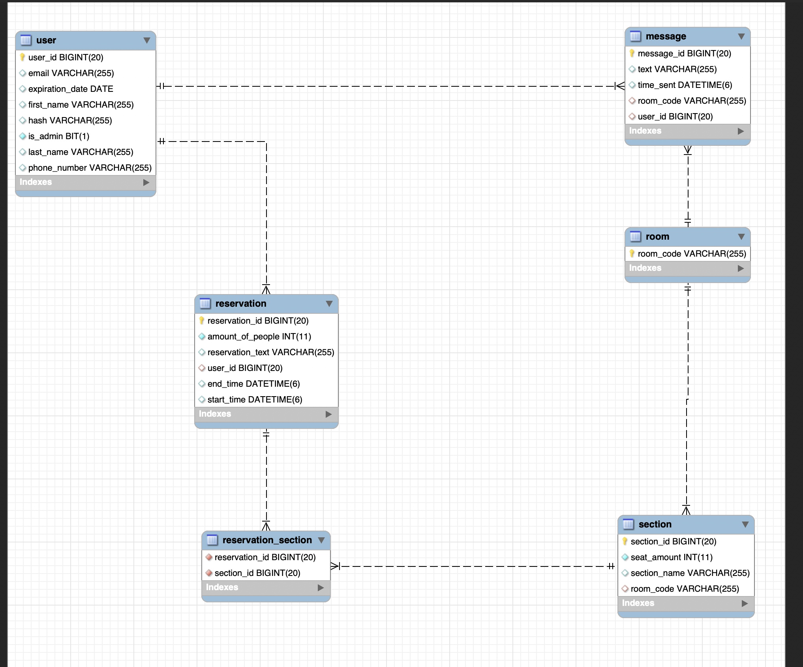

# Book That Room

**Application website:** [Book That Room](https://idatt2105-project.vercel.app/)

Made by: Rokas Bliudzius, Martin Slind Hagen, Diderik Kramer  
Last run CI/CD: [Github Actions](https://github.com/diderikk/idatt2105_project/actions)

## Content

1. [Introduction](#introduction)
2. [Functionality](#functionality)
3. [ER-diagram](#er-diagram)
4. [REST-API](#rest-api)
5. [Security](#security)
6. [CI/CD](#cicd)
7. [Dependencies](#dependencies)
8. [Future work](#future-work)
9. [Installation manual](#installation-manual)
10. [Running tests](#running-tests)

## Introduction

Book That Room is an web application made for booking rooms. Users are able to reserve rooms or individual parts of rooms as sections. Users, rooms and sections are created by admins, that have full access to all information on the website. When a user is created, an email with login credentials is sent to the user's email.

The application is made with Vue 3 as frontend framework which is one of the popular frameworks. To write Vue, the team used TypeScript instead of JavaScript. This is because it has types, which makes code easier to understand and write. Additionally, it uses a compiler that gives clearer errors than JavaScript. By using the vue composition api instead of options api typescript has better support. To avoid spending valuble time writing CSS, the team chose to implement a CSS-framework called Bulma. It has predefined classes to simply create well proportioned components that fits both mobile and desktop. For backend, Spring Boot with Java and Maven was used to create a REST-API server, that frontend clients can send requests to. Both backend and frontend are deployed/hosted: Backend is deployed on a virtual server hosted by Azure, whilst frontend is deployed on Vercel.

## Functionality

### User

- Log in
- View user's reservations
- Book rooms/sections of a room
- Administer user's reservations
- View all rooms
- Join room chat
- View profile information

### Admin

- Log in
- View and administer all reservations
- View and administer all rooms
- View and administer all users
- Create users, rooms and reservations
- View statistics of rooms and users
- Join room chat

## ER-diagram



## REST-API

Link to REST-API page: [Book That Room API](https://bookthatroomserver.northeurope.cloudapp.azure.com:8443/swagger-ui/)

## Security

Book That Room has security on both frontend and backend. This is to ensure that users can not access information and make changes that they are not allowed to make. In backend the team used Spring Security and JWT to achieve these goals. JWT are tokens that contains encrypted user information, and are sent between the server and clients after logging in. For each request sent to the backend server, the token is validated before returning a response. Additionally, Spring Security has good implementations on role authentication, because it is simple to define roles and their permissions. It also uses filters. These are layers of security that a request is sent through to get authenticated. Each layer passes on the request trying to authenticate until it reaches the endpoint destination. The main focus of frontend is to make it as hard as possible to send maliscous request to backend. This is done by configuring axios to throw the user out whenever an error with status 401 or 403 is received. A router that has a permission system of Admin, User or none. The vuex store combined with localStorage is used to store the JWT token as well as the state of the current user.

## CI/CD

### CI

Continuos Integration is done on Github when creating or updating an open pull request. The team currently have only implemented CI for backend, because it was deemed unnecessary implementing it for frontend. For CI backend, it runs all tests defined under the test folder: [Backend CI](https://github.com/diderikk/idatt2105_project/blob/dev/.github/workflows/backend.yml)

Test coverage (defined by missing test coverage):  


### CD

Continuous Deployment on backend is done on Github when the "dev" branch is being merged with the "master" branch. It ssh'es into the virtual machine hosted on Azure and removes the current backend folder, copies over the latest version, adds the config.properties file and the TLS certificate. It perceeds to stop the docker container, which will trigger a server.service file in the VM, that will start the server again. [Backend CI](https://github.com/diderikk/idatt2105_project/blob/dev/.github/workflows/backend.yml)

Continuous Deployment on frontend is done automatically by Vercel when pushing changes to the "master" branch. It also creates "preview deployments" for a branch on every pull request.

## Dependencies

### Backend

- Maven
  - Build automation tool for the backend application written in Java
- Spring Boot
  - Application framework for easily creating stand-alone applications with Java
- Spring Security
  - Powerful authentication and access-control framework. Standard for Spring-based applications when using Spring Boot
- Swagger
  - For hosting of API.
- Java Persistence API (JPA)
  - A programming interface specification for management of relational data in Java applications
- Docker (optional)
  - Can be used to safely build and run applications in isolated containers

### Frontend

- Vue.js 3
  - Open source JavaScript framework for building interfaces and applications
- Typescript
  - A strict syntactical superset of JavaScript programming language, helpful to avoid typical JavaScript errors
- Babel
  - Free and open-source JavaScript compiler, so that the code can be run by older JavaScript engines
- ESlint
  - Static code analysis tool for problem identification in JavaScript code
- Bulma
  - Free open-source CSS framework that provides ready-to-use components to build responsive web interfaces

## Future work

### Reservation of equipment

To add more functionality to the application, a reservation system for various equipment might be a good addition. Equipment such as computers, computer screens, whiteboards and books could be be helpful for people reserving rooms without having their own equipment. It would provide users with more possibilities without adding much complexity to the application.

### Reservation cache

If a user books the same room/sections multiple times, it would be very helpful if the application could “remember” user’s preferences. This way, when the user tries to book a room again, the system can suggest rooms and sections based on user’s previous reservation history. The feature could be very helpful, and possibly improve user experience.

### Visitor registration

The world is still recovering from a pandemic, which has shown how important it is to control spread of a virus by mapping it. A registration system for different rooms and sections would be very useful in times like this. All visitors would have an opportunity to register their visits to different rooms, and help control possible pandemic outbreaks.

### Refresh tokens

Future work would also include implementation of refresh tokens for better user management, which also leads to better user experience. This feature would allow users to use the application indefinitely, without being timed out after user token expires.

### Groups

A system that allows users to make groups would also be implemented in the future. This would allow users to make groups and group chats. Groups would also be able to book rooms and sections together. This feature would be very helpful for group projects or other activities including teamwork.

### Server performance

The team had limited time and resources in the application development, but for future work, upgrading the database and updating some of the code would come with great benefits. Some of the benefits would be increased speed on database lookups, which would slightly improve user experience, and larger database capacity to store more information.

## Installation manual

For building and running the application on different environments, [Docker](https://docs.docker.com/engine/install/) can be used.
[Maven](https://maven.apache.org/install.html) is needed to run backend application.

To run the server and client locally (so that they communicate with eachother):

Change constant isTesting to **true** in _frontend/src/backend.ts_ and run following commands under, depending on the wished behaviour of the application.

To run Spring Boot a config.properties file is needed in _src/main/resources_

```
database.url=DATABASE_URL
database.username=DATABASE_USERNAME
database.password=DATABASE_PASSWORD
// Admin user created on startup
root.email=ROOT_EMAIL
root.password=ROOT_PASSWORD
email.email=EMAIL_EMAIL
email.password=EMAIL_PASSWORD
```

### Backend

_Make (with Docker and Maven)_

```
make backend_dev
```

_Docker (with Maven)_

```
mkdir backend/src/main/resources/keystore
keytool -genkeypair -dname "cn=, ou=, o=, c=NO" -alias fullstack -storepass password -keypass password -keyalg RSA -keysize 2048 -storetype PKCS12 -keystore backend/src/main/resources/keystore/cert_key.p12 -validity 3650
mvn -B -DskipTests -f ./backend package
docker build -t backend-server ./backend
docker run -p 8443:8443 --name backend --rm backend-server

```

_Maven_

```
cd backend/
./mvnw spring-boot:run
```

### Frontend

_Make (with Docker and Maven)_

```
make frontend_serve
```

_Docker (with Maven)_

```
docker build -t frontend-server ./frontend
docker run -p 3000:3000 --name frontend --rm frontend-server
```

_npm (node package manager)_

```
cd frontend/
npm install
npm run serve
```

## Running tests

User Maven commands to run tests (backend):

```
cd backend/
./mvnw test
```
